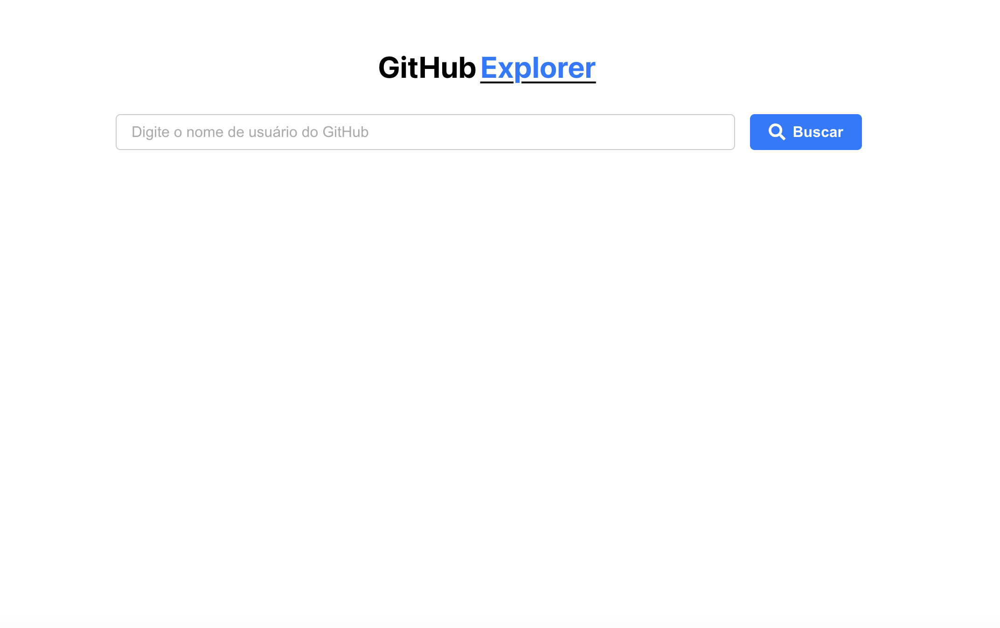
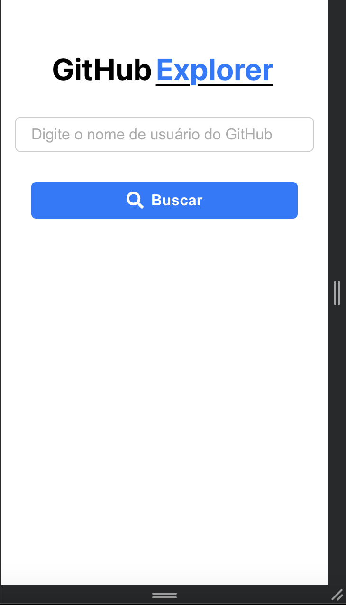

# Projeto Github Explorer

Este projeto, chamado GitHub Explorer, é uma aplicação desenvolvida para facilitar a busca por usuários no GitHub. Ele exibe informações detalhadas sobre os usuários e seus repositórios, permitindo acessá-los de maneira rápida e eficiente.

## Pré-requisitos

1. Node.js
2. npm ou yarn
3. Terminal

## Rodar o projeto

1. npm install 
2. npm start

A aplicação normalmente é iniciada na porta 3000. Para acessá-la, 
basta visitar o endereço http://localhost:3000 no seu navegador.

### `npm run build`

Compila o aplicativo para produção na pasta build. Ele empacota corretamente o React 
no modo de produção e otimiza a compilação para obter o melhor desempenho.

## Aplicação 

Acesse a aplicação aqui: [Link da aplicacao](https://link-da-demo.com)

## Demonstração

## Apis consumidas no projeto

1. Detalhes de um usuário: https://api.github.com/users/{username}
2. Repositórios de um usuário: https://api.github.com/users/{username}/repos
3. Detalhes de um repositório: https://api.github.com/repos/{full_name}
 
 ## Tecnologias Utilizadas no Projet

 O projeto foi desenvolvido utilizando um conjunto de tecnologias modernas e ferramentas que garantem desempenho,
 escalabilidade e uma ótima experiência para o usuário. As principais tecnologias utilizadas foram:

 1. React.js
 2. Css 
 3. Axios
 4. React Router Dom
